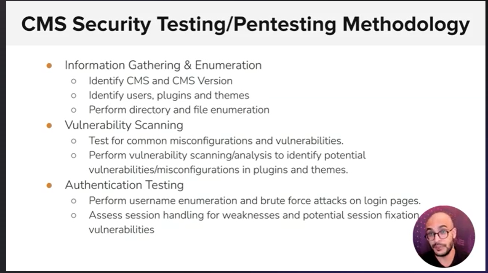

# 12. Introduction to the Web & HTTP Protocol

Category: Web Attacks
Completed in INE: No
INE Section: Section 4 - Web Application Penetration Testing
Resource Type: Course Note
Study Status: Not Started
Tool/Topic: HTTP

# Web Application Penetration Testing: Introduction to the Web & HTTP Protocol

As a Penetration Tester, it is vitally important to understand how web applications work, how they are secured, how they communicate with web browsers, the threats/vulnerabilities affecting modern web applications, and how to perform a professional security assessment on web applications. This course will provide a solid understanding of essential web application security concepts and practices, including common attack vectors, security risks, and the importance of secure coding practices. It also covers important aspects of web application architecture, the technologies and components that make up a web application stack, and how browsers and web applications communicate with each other over HTTP/S.

# **Intro to Web**

# **What is a Website?**

A website is a collection of interconnected web pages that are accessible over the internet. It contains various types of content, such as text, images, videos, and links, designed to provide information or engage with users.

# **What is a Webserver & types of servers?**

A webserver is software that serves web content to users' browsers when they request a website. Different types include:

1. **HTTP Server:** Handles Hypertext Transfer Protocol requests, delivering web pages and resources.
2. **Application Server:** Runs applications, processes data, and manages user interactions.
3. **Database Server:** Stores and manages data used by web applications and websites.

# **What is Off-Premise Hosting?**

Off-Premise Hosting, also known as cloud hosting, involves hosting websites or applications on remote servers rather than on-site servers.

# **HTTP Protocols**

- HTTP protocols dictate how web browsers and servers communicate, influencing the speed, security, and efficiency of data exchange on the internet.
    - **HTTP/1.0:** is an early version of the Hypertext Transfer Protocol. It allows clients to request resources from a web server, but each request requires a new connection, making it less efficient for modern web applications.
    - **HTTP/1.1:** improved upon the previous version by introducing persistent connections, allowing multiple requests and responses to be exchanged over a single connection. It also added support for content compression and chunked transfer encoding.
    - **HTTP/2:** is a significant update that enhances performance by multiplexing multiple requests and responses over a single connection. It prioritizes and streams data, reducing latency and improving website loading speed.
    - **HTTP/3:** is the latest version, designed to further improve performance by utilizing the QUIC transport protocol. It aims to minimize latency and connection setup times, resulting in faster and more secure web experiences.

# **What are Headers?**

Headers are elements in an HTTP request or response that provide important metadata about the message. They convey information about the content, encoding, caching, and more, facilitating proper communication between clients and servers.

# **Types of Headers:**

1. **Request Headers**: Included in the client's HTTP request to provide context and preferences, such as user agent, accepted languages, and authentication tokens.
2. **Response Headers**: Sent by the server in the HTTP response to provide information about the server, content, caching directives, and more.
3. **Entity Headers**: Pertaining to the content itself, these headers define the type, length, and encoding of the data being sent or received.

# **Security Headers:**

1. **X-Frame-Options**: Prevents clickjacking attacks by controlling whether a page can be displayed in a frame or iframe.
2. **X-XSS-Protection**: Helps mitigate cross-site scripting (XSS) attacks by enabling browser protections.
3. **Content-Security-Policy**: Mitigates risks of code injection by specifying which content sources are allowed.
4. **Strict-Transport-Security**: Enforces HTTPS usage by instructing the browser to only use secure connections.
5. **Referrer-Policy**: Controls how much information is included in the HTTP Referer header, enhancing privacy. </aside>

HTTP Request

# **What is a Request?**

A request is a message sent by a client, usually a web browser, to a server when it wants to retrieve a specific resource, like a webpage or an image. The request includes various details to help the server understand the client's requirements.

# **Types of Request Headers:**

1. **User-Agent**: Informs the server about the client's browser and operating system, helping the server provide appropriate content.
2. **Accept**: Indicates the types of content the client can understand, allowing the server to send the appropriate format.
3. **Authorization**: Used to include credentials, like tokens or passwords, for authentication purposes.
4. **Referer**: Shows the URL of the page that linked to the current page, aiding in tracking traffic sources.
5. **Cookie**: Contains data stored on the client side and sent to the server with each request, often used for session management.
6. **Cache-Control**: Specifies caching directives to control how the client or intermediary caches should handle the response.
7. **Content-Type**: Informs the server about the type of data the client is sending in the request, often used in POST requests.
8. **Origin**: Indicates the origin of the request, helping servers determine if cross-origin requests should be allowed.

# **What is a Response?**

A response is the message sent by a server to a client, typically a web browser, after it receives and processes a request. The response contains the requested resource along with various details about the content and server instructions.

# **Types of Response Headers:**

1. **Server**: Specifies the type and version of the web server software used to generate the response.
2. **Content-Length**: Informs the client about the size of the response content, helping in proper rendering.
3. **Content-Type**: Indicates the format of the response content, such as HTML, JSON, or images.
4. **Cache-Control**: Defines caching directives for the client or intermediaries to determine how to store the response.
5. **Location**: Used in redirection responses (e.g., 301 or 302) to guide the client to a different URL.
6. **Set-Cookie**: Provides instructions to set a cookie on the client side, often used for session management.
7. **Strict-Transport-Security**: Informs the client that future requests should only be made using HTTPS for security reasons.
8. **Access-Control-Allow-Origin**: Specifies which origins are allowed to access a resource in cross-origin requests.

# **What are sessions?**

Sessions are a way for websites to maintain a temporary connection between a user and the server during their visit. They enable the server to remember user-specific information as the user navigates different pages, enhancing the user experience and enabling personalized interactions.

# **What is Cookie?**

A cookie is a small piece of data that a website sends to a user's web browser, which the browser then stores on the user's device. Cookies are used to remember information about the user and their interactions with the website, enhancing user experience and enabling personalized features.

# **What are the cookie attrubites?**

Cookie attributes allow websites to control the behavior, security, and scope of cookies, ensuring they enhance user experience while adhering to privacy and security considerations.

1. **Name:** The unique identifier of the cookie, used to distinguish it from other cookies.
2. **Value:** The data associated with the cookie, such as user preferences or session information.
3. **Domain:** Specifies the domain to which the cookie belongs, determining which websites can access the cookie.
4. **Path:** Defines the URL path for which the cookie is valid, allowing more precise control over where the cookie is sent.
5. **Expires/Max-Age:** Determines the cookie's lifespan, either by specifying an expiration date or a maximum age (in seconds) since creation.
6. **Secure:** If set, the cookie is only sent over secure (HTTPS) connections, enhancing its protection.
7. **HttpOnly:** If set, the cookie is inaccessible via JavaScript, reducing the risk of cross-site scripting (XSS) attacks.
8. **SameSite:** Controls when the cookie is sent in cross-site requests, enhancing security and privacy.
9. **Priority:** An attribute that controls the order in which cookies are sent to the server.
10. **Size:** The maximum size (in bytes) of the cookie's value and metadata combined.

Cookies

# **Tools set for basic web assessment**

Below mentioned tools assist in basic web assessment by scanning networks, identifying hidden content, and interacting with web servers to analyze their responses and content.

- **Nmap:** Nmap (Network Mapper) is a powerful network scanning tool that helps identify hosts and services on a network. It uses various techniques to determine open ports, services, and potential vulnerabilities on target systems.
- **Dirb:** Dirb is a web content scanner used to discover hidden directories and files on a web server. It performs directory brute-forcing to identify paths that might not be publicly visible but could still be accessed.
- **cURL:** cURL (Client URL) is a command-line tool for transferring data using various protocols, including HTTP. It's often used to send HTTP requests and receive responses, making it useful for checking web server responses and debugging. </aside>

# **HTTP Methods in detail**

HTTP methods are ways that web applications use to communicate with servers. These methods define the type of action a web request wants to perform. They help in fetching, sending, updating, or deleting data on the internet. There are different types of HTTP methods, some of which can be less secure.

# **The main types of HTTP methods are:**

1. **GET:** This method is used to retrieve information from a server. When you open a web page or view an image, your browser sends a GET request to the server to fetch that content.
2. **POST:** When you submit a form on a website, like filling out a registration form, the data you provide is sent to the server using the POST method. It's used for sending data to be processed and stored.
3. **PUT:** This method is used to update or replace existing data on the server. It's like editing an existing document and saving the changes.
4. **DELETE:** As the name suggests, this method is used to request the removal of data from the server. It's often used to delete files or records.
5. **PATCH:** Similar to the PUT method, PATCH is used to update data. However, unlike PUT, which typically replaces the entire resource, PATCH makes partial updates to the resource.
6. **HEAD:** This method is similar to GET, but it only asks the server to send the headers (metadata) of the requested resource, not the actual content. It's often used to check if a resource has been modified without actually downloading it.
7. **OPTIONS:** This method is used to ask the server about the available communication options for a resource. It helps clients understand which methods and headers are supported by the server.

# **Insecure methods**

Insecure methods, also known as "unsafe" methods, refer to HTTP methods that can potentially expose security vulnerabilities if not used correctly. These methods include:

1. **GET:** While not inherently insecure, sensitive data should not be sent through a GET request, as the data can be visible in the URL and browser history.
2. **PUT and DELETE:** These methods can be risky if not properly authenticated and authorized. They can lead to unintended modifications or deletions of data.

# **Tool Usage**

- `DIRB` is a command-line tool used for directory and file enumeration on web servers.
    - In a previous session, we utilized `Dirb`, and I recommend referring to that to learn more about it.
- `cURL` is a command-line tool used for making HTTP requests to URLs and retrieving or sending data.
    - `curl <https://www.example.com`>: **Retrieve a Web Page**
    - `curl -O <https://www.example.com/file.txt`:> **Download a File**
    - `curl -X POST -d "param1=value1&param2=value2" <https://www.example.com/api`:> **HTTP POST Request**
    - `curl -I <https://www.example.com`>: **Fetches and displays only the headers of the URL response.**
    - `curl -u username:password <https://api.example.com/data`:> **Accesses a resource using HTTP Basic Authentication.**
    - `curl -L <https://www.example.com`> : **Follow Redirects**
    - `curl -A "Custom User Agent" <https://www.example.com`>: **Set Custom User Agent**
    - `curl **<https://www.example.com>** --upload-file test.txt`: uploads the file "test.txt" to the specified URL.
- `Burp Suite` is a cybersecurity tool used for web application testing and security assessment. It helps identify vulnerabilities like SQL injection and cross-site scripting by intercepting and analyzing web traffic. Security professionals use it to enhance the security of web applications.

